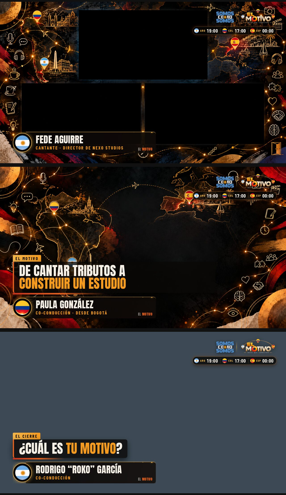

# El Motivo · Gráfica en vivo

Mosca, zócalos y oversize de El Motivo para vMix, en 1920×1080.

## Qué hay

| Pieza | Dónde | Cómo se usa |
| --- | --- | --- |
| Mosca con relojes | `El_Motivo_grafica.html#mosca` | Siempre al aire. Logos de Somos Como Somos y El Motivo, y la hora de Argentina, Colombia y España, en vivo (los cambios de horario se ajustan solos). |
| Control de zócalos y oversize | `El_Motivo_grafica.html` (sin nada al final) | Panel para editar textos y sacar o poner cada capa con teclas o con el Stream Deck. |
| Salida de esas capas | `El_Motivo_grafica.html#salida` | La ventana que captura vMix. Se sincroniza con la de control. |
| PNG transparentes | `png/` o `El_Motivo_grafica_PNG.zip` | Para cargar en vMix como imagen y usarlos como overlay. La mosca en PNG va sin hora. |

Online: https://claude.ai/artifact/UBzPhFszKjVCncucAUtTp7 (privada hasta que se comparta; para vMix conviene el archivo local).

## Armado sugerido en vMix

1. **Mosca:** Add Input → Web Browser → el archivo `El_Motivo_grafica.html#mosca`, 1920×1080. Si el fondo no sale transparente, usar Desktop Capture de una ventana de Chrome con `#mosca`, fondo verde (tecla B) y Chroma Key.
2. **Zócalos y oversize:**
   - **Opción A (más simple):** cargar los PNG de `png/` como inputs de imagen y prenderlos como overlay desde vMix o el Stream Deck.
   - **Opción B (textos editables en el momento):** Chrome con dos ventanas, una sin nada al final (control) y otra con `#salida` (fondo verde). En vMix, Desktop Capture de la salida con Chroma Key.

El oversize va siempre arriba de la zona del zócalo, así se pueden mostrar los dos juntos.

## Teclas (ventana de control o de salida)

| Tecla | Qué hace |
| --- | --- |
| `1`–`9` | Zócalo de esa persona (otra vez lo saca) |
| `Q` `W` `E` `R` `T` `Y` `U` `I` `O` | Oversize 1 a 9 (otra vez lo saca) |
| `0` | Saca el zócalo |
| `P` | Saca el oversize |
| `L` | Saca zócalo y oversize |
| `M` | Mosca |
| `H` | Relojes |
| `B` | Fondo de la salida: transparente, verde o negro |
| `F` | Pantalla completa |

## Textos de fábrica

**Zócalos:** Fabricio Benjamín Ortega (Conducción) · Rodrigo “Roko” García (Co-conducción) · Paula González (Co-conducción · desde Bogotá) · Fede Aguirre (Cantante · Director de Nexo Studios).

**Oversize:** Ideas que conectan · De cantar tributos a construir un estudio · Con quién compartiría escenario · Nexo empezó con una historia de Instagram · La inauguración de Nexo Studios · Lo que te llevás para animarte · ¿Cuánto vale tu tiempo? · ¿Cuál es tu motivo?

Se cambian en el panel. Entre asteriscos va la parte en naranja.

## Editar y volver a exportar

- Se edita `fuente.html` y se corre `python3 build.py` (arma la versión online y el archivo local con las imágenes de `assets/` adentro).
- `node exportar.js` vuelve a generar los PNG con los textos de fábrica.
